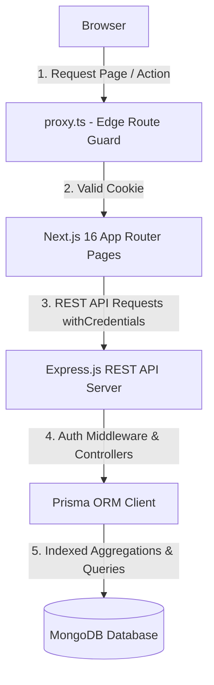
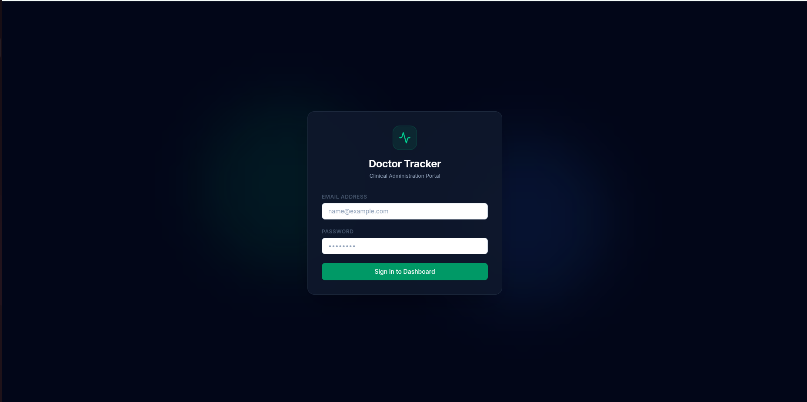
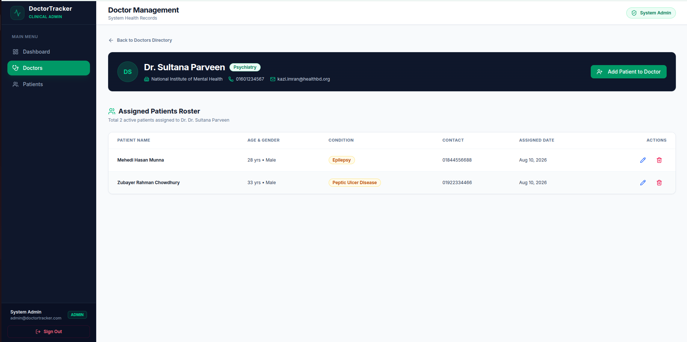
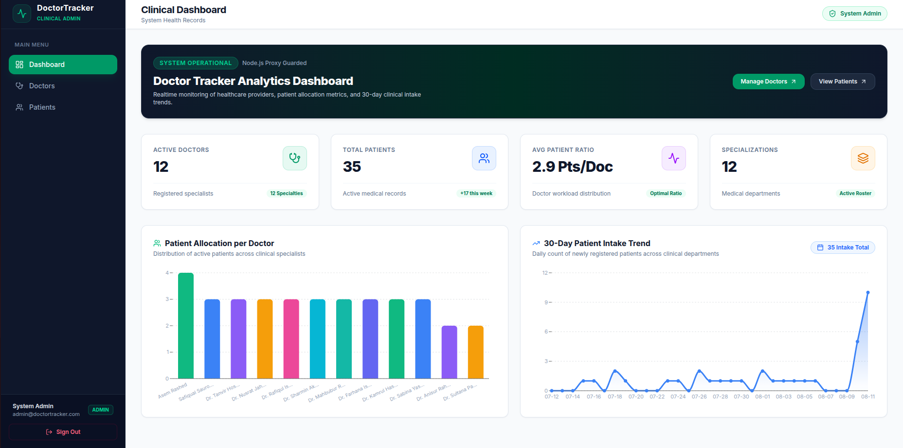
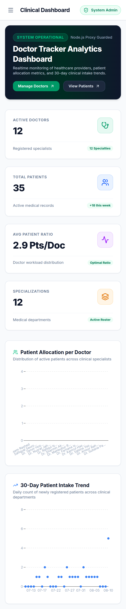
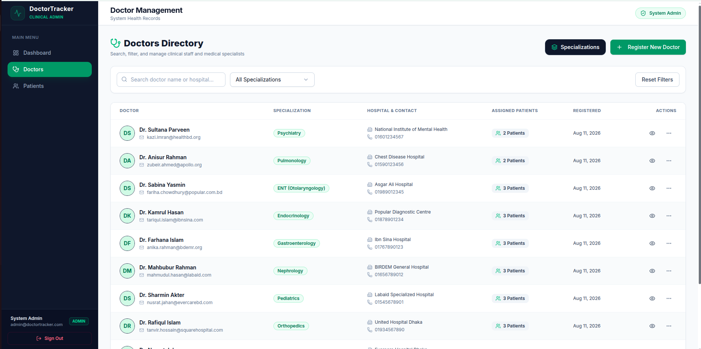
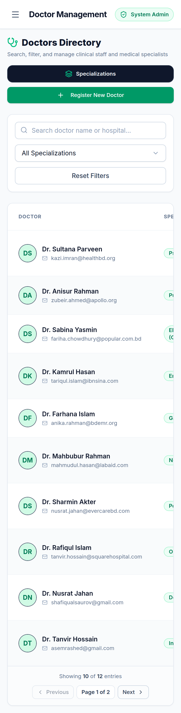
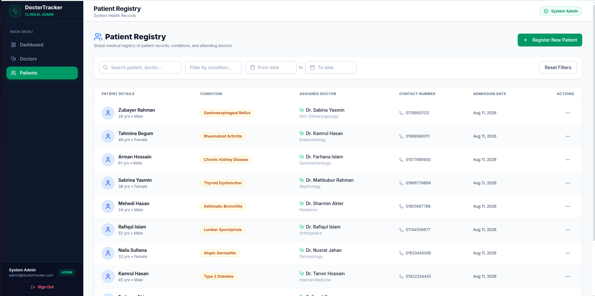
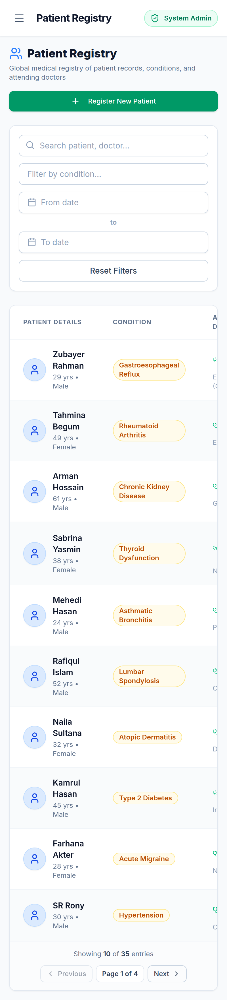

# Doctor Tracker

## Description
Doctor Tracker is a secure, high-performance administrative application engineered for healthcare providers and clinical administrators to streamline medical staff management and patient registry tracking. By centralizing doctor rosters, nested patient assignments, specialty categorization, and real-time clinical workload statistics into a unified web portal, Doctor Tracker replaces error-prone manual spreadsheets with an audit-ready, role-guarded platform. It delivers instant operational visibility into physician availability, patient intake trends, and department workloads across mobile, tablet, and desktop environments.

- **Live Application Domain**: [https://doctor-tracking-portal.mhadnan.com](https://doctor-tracking-portal.mhadnan.com)

## Setup Guide

### MongoDB Replica-Set Requirement
Prisma ORM requires a MongoDB replica set to support transactional operations and schema aggregations. The easiest way to satisfy this requirement is by creating a free cluster on MongoDB Atlas, which provides replica-set support out of the box. Alternatively, local MongoDB instances must be initiated with `--replSet` enabled.

---

### Backend Setup (`doctor-tracker-backend`)

1. **Clone the repository:**
   ```bash
   git clone git@github.com:Adnan4141/doctor-tracking-backend.git
   cd doctor-tracking-backend
   ```

2. **Install dependencies:**
   ```bash
   npm install
   ```

3. **Configure environment variables:**
   Create a `.env` file in the root of `doctor-tracker-backend`:
   ```env
   PORT=4005
   NODE_ENV=development
   DATABASE_URL="mongodb+srv://<username>:<password>@cluster.mongodb.net/doctor-tracking-portal?retryWrites=true&w=majority"
   JWT_SECRET="your_production_jwt_secret_key_minimum_32_characters"
   CLIENT_URL="http://localhost:3000"
   ```

4. **Generate Prisma client and push schema:**
   ```bash
   npx prisma generate
   npx prisma db push
   ```

5. **Run the backend development server:**
   ```bash
   npm run dev
   ```
   The backend REST API will start on `http://localhost:4005`.

---

### Frontend Setup (`doctor-tracker-frontend`)

1. **Clone the repository:**
   ```bash
   git clone git@github.com:Adnan4141/doctor-tracking-frontend.git
   cd doctor-tracking-frontend
   ```

2. **Install dependencies:**
   ```bash
   npm install
   ```

3. **Configure environment variables:**
   Create a `.env.local` file in the root of `doctor-tracker-frontend`:
   ```env
   NEXT_PUBLIC_API_URL="http://localhost:4005/api"
   ```

4. **Run the frontend development server:**
   ```bash
   npm run dev
   ```
   Open `http://localhost:3000` (or `https://doctor-tracking-portal.mhadnan.com` in production).

## System Architecture

Doctor Tracker uses a client-server architecture with an edge-guarded frontend and a RESTful backend. Requests originate in the browser, pass through Next.js 16's edge request pipeline where `proxy.ts` verifies session cookies before serving protected routes, and issue authenticated HTTP REST calls with credentials (`withCredentials: true`) to the Express backend. The backend executes business logic, invokes Prisma ORM for type-safe database queries, and aggregates data directly inside MongoDB.



## Technical Decisions

### Prisma over Mongoose

We selected Prisma ORM over Mongoose to enforce strict compile-time TypeScript safety, eliminate schema drifting, and leverage declarative data modeling across our full-stack application. While Mongoose provides loose document schemas, Prisma generates custom TypeScript types directly from the schema definitions. This eliminates manual interface duplication between the backend models and API response DTOs. 

Concretely, Prisma's relational schema syntax allows us to define database indexes (`@@index([specialization])`, `@@index([createdAt])`) declaratively while benefiting from static type checking during database queries. The key tradeoff is that Prisma requires MongoDB to run as a replica set to handle transactions and structural aggregations, which adds a minor infrastructure requirement compared to Mongoose's standalone MongoDB support. However, this requirement is easily met with MongoDB Atlas and is offset by Prisma's auto-generated types, reduced runtime errors, and type safety across our database calls.

### httpOnly-cookie JWT (validated in proxy.ts) over localStorage Tokens

We implemented JWT authentication stored exclusively in `httpOnly`, `SameSite=Lax` cookies, guarded at the routing edge by Next.js 16's `proxy.ts`, rather than storing access tokens in `localStorage`. Storing JSON Web Tokens in `localStorage` leaves applications vulnerable to Cross-Site Scripting (XSS) attacks, as any client-side JavaScript script can read `localStorage` keys and exfiltrate credentials. 

By storing JWTs in `httpOnly` cookies, the browser automatically attaches authentication credentials to API requests while strictly preventing JavaScript execution environments from accessing the token. Integrating this with Next.js 16's `proxy.ts` middleware allows us to intercept incoming navigation requests at the server edge, validating the token before rendering protected routes (`/dashboard`, `/doctors`, `/patients`). This eliminates unauthenticated client UI flashes and improves security. The tradeoff is that cross-origin API deployments require precise CORS origin configuration (`credentials: true`) and cookie domain scoping, but this extra configuration provides defense against token theft and unauthorized access.

## Visual Evidence

<table>
  <tr>
    <td width="50%" align="center">
      <h3>🔑 Login Page</h3>
      
      <p><em>Secure authentication interface with httpOnly cookie session.</em></p>
    </td>
    <td width="50%" align="center">
      <h3>👨‍⚕️ Doctor Detail Profile</h3>
      
      <p><em>Detailed profile page with assigned patient roster.</em></p>
    </td>
  </tr>
  <tr>
    <td width="50%" align="center">
      <h3>📊 Dashboard (Desktop)</h3>
      
      <p><em>Clinical analytics, staff KPIs & intake trends.</em></p>
    </td>
    <td width="50%" align="center">
      <h3>📱 Dashboard (Mobile)</h3>
      
      <p><em>Responsive mobile view with touch navigation drawer.</em></p>
    </td>
  </tr>
  <tr>
    <td width="50%" align="center">
      <h3>🩺 Doctors Registry (Desktop)</h3>
      
      <p><em>Specialization filtering, search & staff management.</em></p>
    </td>
    <td width="50%" align="center">
      <h3>📱 Doctors Registry (Mobile)</h3>
      
      <p><em>Mobile doctor cards with stacked action buttons.</em></p>
    </td>
  </tr>
  <tr>
    <td width="50%" align="center">
      <h3>📋 Patient Registry (Desktop)</h3>
      
      <p><em>Medical condition filtering & zebra-striped data table.</em></p>
    </td>
    <td width="50%" align="center">
      <h3>📱 Patient Registry (Mobile)</h3>
      
      <p><em>Mobile responsive patient table & touch controls.</em></p>
    </td>
  </tr>
</table>
